# Development Guide

Everything you need to set up a development environment, run tests, and
contribute to sqlalchemy-cubrid.

---

## Table of Contents

- [Prerequisites](#prerequisites)
- [Installation](#installation)
- [Project Structure](#project-structure)
- [Make Targets](#make-targets)
- [Running Tests](#running-tests)
- [Docker Integration Testing](#docker-integration-testing)
- [Multi-Version Testing](#multi-version-testing)
- [Code Coverage](#code-coverage)
- [Code Style](#code-style)
- [Pre-Commit Hooks](#pre-commit-hooks)
- [CI/CD Pipeline](#cicd-pipeline)

---

## Prerequisites

| Requirement | Version |
|---|---|
| Python | 3.10+ |
| Git | any |
| Docker | any (for integration tests) |
| Docker Compose | v2+ |

---

## Installation

### Quick Setup

```bash
git clone https://github.com/cubrid-labs/sqlalchemy-cubrid.git
cd sqlalchemy-cubrid
make install
```

`make install` performs:
1. `pip install -e ".[dev]"` — editable install with dev dependencies
2. `pip install pytest-cov pre-commit tox` — test tooling
3. `pre-commit install` — git hook setup

### Manual Setup

```bash
# Create and activate a virtual environment
python3 -m venv venv
source venv/bin/activate  # Linux/macOS
# venv\Scripts\activate   # Windows

# Install in editable mode with dev dependencies
pip install -e ".[dev]"

# Install test coverage and multi-version tools
pip install pytest-cov tox

# (Optional) Install pre-commit hooks
pip install pre-commit
pre-commit install
```

---

## Project Structure

```mermaid
graph TD
    root["sqlalchemy-cubrid/"]

    pkg["sqlalchemy_cubrid/ - Main package"]
    tests["test/ - Test suite"]
    docs["docs/ - Documentation"]
    samples["samples/ - Usage examples"]
    pyproject["pyproject.toml - Project config, dependencies"]
    tox["tox.ini - Multi-Python test config"]
    docker["docker-compose.yml - CUBRID Docker setup"]
    makefile["Makefile - Development shortcuts"]
    contributing["CONTRIBUTING.md - Contribution guidelines"]

    root --> pkg
    root --> tests
    root --> docs
    root --> samples
    root --> pyproject
    root --> tox
    root --> docker
    root --> makefile
    root --> contributing

    pkg --> init["__init__.py - Public API, version, type exports"]
    pkg --> base["base.py - ExecutionContext, IdentifierPreparer"]
    pkg --> compiler["compiler.py - SQL/DDL/Type compilers"]
    pkg --> dialect["dialect.py - CubridDialect (reflection, connection, etc.)"]
    pkg --> pycubrid_dialect["pycubrid_dialect.py - Pure Python driver dialect"]
    pkg --> aio_dialect["aio_pycubrid_dialect.py - Async pycubrid.aio dialect"]
    pkg --> dml["dml.py - ON DUPLICATE KEY UPDATE, MERGE constructs"]
    pkg --> trace["trace.py - Query tracing utility"]
    pkg --> types["types.py - CUBRID type system"]
    pkg --> req["requirements.py - SA 2.0 test requirement flags"]
    pkg --> alembic["alembic_impl.py - Alembic migration support"]
    pkg --> typed["py.typed - PEP 561 marker"]

    tests --> tcomp["test_compiler.py - SQL compilation tests"]
    tests --> ttypes["test_types.py - Type system tests"]
    tests --> tdialect["test_dialect_offline.py - Dialect tests (no DB)"]
    tests --> tbase["test_base.py - Base module tests"]
    tests --> treq["test_requirements.py - SA requirement flag tests"]
    tests --> tdml["test_dml.py - DML construct tests"]
    tests --> talembic["test_alembic.py - Alembic integration tests"]
    tests --> taio["test_aio_pycubrid_dialect.py - Async dialect tests"]
    tests --> taioint["test_aio_integration.py - Async integration tests"]
    tests --> tjson["test_json.py - JSON type and path tests"]
    tests --> tpackaging["test_packaging.py - Packaging and entry point tests"]
    tests --> tshowcreate["test_show_create_table.py - Reflection parser tests"]
    tests --> ttrace["test_trace.py - Query trace tests"]
    tests --> tintegration["test_integration.py - Live DB integration tests"]
    tests --> tsuite["test_suite.py - SA test suite runner"]
    tests --> tconftest["conftest.py - Test fixtures"]
```



---

## Make Targets

All common development tasks are available via `make`:

```bash
make help          # Show all available targets
make install       # Install in dev mode with all dependencies
make lint          # Run ruff linter + format checks
make format        # Auto-fix lint issues and format code
make test          # Run offline tests with coverage (95% threshold)
make test-all      # Run tox across all Python versions
make integration   # Start Docker → run integration tests → stop Docker
make docker-up     # Start CUBRID Docker container
make docker-down   # Stop and remove CUBRID Docker container
make clean         # Remove build artifacts and caches
```

---

## Running Tests

### Offline Tests (No Database Required)

The majority of the test suite runs without a live CUBRID instance:

```bash
# Run all offline tests
pytest test/ -v --ignore=test/test_integration.py --ignore=test/test_suite.py \
  --ignore=test/test_aio_integration.py

# Run with coverage report
pytest test/ -v --ignore=test/test_integration.py --ignore=test/test_suite.py \
  --ignore=test/test_aio_integration.py \
  --cov=sqlalchemy_cubrid --cov-report=term-missing

# Run a specific test file
pytest test/test_compiler.py -v

# Run a single test
pytest test/test_compiler.py::TestCubridSQLCompiler::test_select_limit -v
```

### Integration Tests (Requires CUBRID)

```bash
# Start a CUBRID container
docker compose up -d

# Wait for CUBRID to be ready (healthcheck: ~30s)
docker compose logs -f cubrid

# Set the connection URL
export CUBRID_TEST_URL="cubrid://dba@localhost:33000/testdb"

# Run integration tests
pytest test/test_integration.py -v

# Run async integration tests
pytest test/test_aio_integration.py -v

# Stop the container
docker compose down -v
```

### Full SA Test Suite

```bash
# Requires a running CUBRID instance
pytest --dburi cubrid://dba@localhost:33000/testdb
```

---

## Docker Integration Testing

### docker-compose.yml

The project includes a `docker-compose.yml` for local CUBRID instances:

```yaml
services:
  cubrid:
    image: cubrid/cubrid:${CUBRID_VERSION:-11.2}
    environment:
      CUBRID_DB: testdb
    ports:
      - "33000:33000"
    healthcheck:
      test: ["CMD", "csql", "-u", "dba", "testdb", "-c", "SELECT 1"]
      interval: 15s
      timeout: 10s
      retries: 10
      start_period: 30s
```

### Testing Against Different CUBRID Versions

```bash
# Default (11.2)
docker compose up -d

# Specific version
CUBRID_VERSION=11.4 docker compose up -d
CUBRID_VERSION=11.0 docker compose up -d
CUBRID_VERSION=10.2 docker compose up -d
```

### Supported CUBRID Versions

| Version | Docker Image |
|---|---|
| 11.4 | `cubrid/cubrid:11.4` |
| 11.2 | `cubrid/cubrid:11.2` (default) |
| 11.0 | `cubrid/cubrid:11.0` |
| 10.2 | `cubrid/cubrid:10.2` |

### Quick Integration Workflow

```bash
# One-command: start, test, stop
make integration
```

---

## Multi-Version Testing

### tox Configuration

The `tox.ini` defines local environments for Python 3.10–3.13. GitHub Actions also runs the offline suite on Python 3.14.

```ini
[tox]
envlist = lint, py310, py311, py312, py313
skip_missing_interpreters = true
```

### Running tox

```bash
# Install tox
pip install tox

# Run all environments
tox

# Run a specific Python version
tox -e py312

# Run lint checks only
tox -e lint
```

### CI Matrix

The CI pipeline tests the following matrix:

| | Python 3.10 | Python 3.11 | Python 3.12 | Python 3.13 | Python 3.14 |
|---|:---:|:---:|:---:|:---:|:---:|
| **Offline Tests** | ✅ | ✅ | ✅ | ✅ | ✅ |
| **CUBRID 11.4** | ✅ | — | ✅ | — | — |
| **CUBRID 11.2** | ✅ | — | ✅ | — | — |
| **CUBRID 11.0** | ✅ | — | ✅ | — | — |
| **CUBRID 10.2** | ✅ | — | ✅ | — | — |

---

## Code Coverage

### Requirements

- **Minimum threshold**: 95% line coverage
- **Current offline collection**: 577 tests (`pytest --collect-only` excluding integration, SA suite, and async integration)
- **Current line coverage**: See CI / Codecov for the latest exact value
- CI enforces the threshold via `--cov-fail-under=95`

### Running Coverage

```bash
# With coverage report
pytest test/ -v \
  --ignore=test/test_integration.py \
  --ignore=test/test_suite.py \
  --ignore=test/test_aio_integration.py \
  --cov=sqlalchemy_cubrid \
  --cov-report=term-missing \
  --cov-fail-under=95

# Or via make
make test
```

### Known Unreachable Lines

Three lines in `compiler.py` and one in `dml.py` are verified unreachable by design (defensive fallbacks that
cannot trigger through SA's public API):

| File | Line | Description |
|---|---|---|
| `compiler.py` | 72 | `for_update_clause` returning `""` |
| `compiler.py` | 84 | `limit_clause` returning `""` |
| `compiler.py` | 298--300 | Defensive branch in DDL compilation |
| `dml.py` | 310 | `else` branch in type normalization |

---

## Code Style

### Ruff

This project uses [Ruff](https://docs.astral.sh/ruff/) for both linting and
formatting.

| Setting | Value |
|---|---|
| Line length | 100 characters |
| Target Python | 3.10+ |
| Linter | `ruff check` |
| Formatter | `ruff format` |

### Running Checks

```bash
# Lint check
ruff check sqlalchemy_cubrid/ test/

# Auto-fix lint issues
ruff check --fix sqlalchemy_cubrid/ test/

# Format check
ruff format --check sqlalchemy_cubrid/ test/

# Apply formatting
ruff format sqlalchemy_cubrid/ test/

# All checks via make
make lint
```

---

## Pre-Commit Hooks

Pre-commit hooks run lint and format checks automatically on `git commit`.

### Setup

```bash
pip install pre-commit
pre-commit install
```

### Manual Run

```bash
# Run all hooks on all files
pre-commit run --all-files
```

---

## CI/CD Pipeline

### GitHub Actions Workflows

| Workflow | File | Trigger |
|---|---|---|
| CI | `.github/workflows/ci.yml` | Push to main, PRs |
| Publish | `.github/workflows/publish-pypi.yml` | GitHub Release |

### CI Pipeline Steps

1. **Lint** — Ruff check + format verification
2. **Offline Tests** — Python 3.10, 3.11, 3.12, 3.13, 3.14 × offline test suite
3. **Integration Tests** — Python {3.10, 3.12} × CUBRID {10.2, 11.0, 11.2, 11.4}, plus async integration coverage
4. **Coverage** — Enforces ≥ 95% threshold

### Publish Pipeline

Triggered on GitHub Release creation. Builds and publishes the package to PyPI.

---

*See also: [Contributing Guide](../CONTRIBUTING.md) · [Feature Support](FEATURE_SUPPORT.md) · [Connection Guide](CONNECTION.md)*
