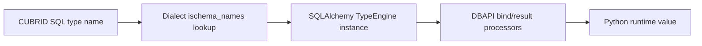

# Type Mapping

This document covers the full type mapping between SQLAlchemy types, CUBRID SQL types, and the CUBRID-specific type extensions provided by this dialect.

---

## Table of Contents

- [Standard SQL Types](#standard-sql-types)
- [CUBRID-Specific Types](#cubrid-specific-types)
  - [Numeric Types](#numeric-types)
  - [String Types](#string-types)
  - [Bit String Types](#bit-string-types)
  - [LOB Types](#lob-types)
  - [Collection Types](#collection-types)
- [Type Reflection (ischema_names)](#type-reflection-ischema_names)
- [Boolean Handling](#boolean-handling)
- [Text and STRING](#text-and-string)
- [Usage Examples](#usage-examples)

---

## Standard SQL Types

The dialect maps standard SQLAlchemy types to CUBRID SQL types:

| SQLAlchemy Type      | CUBRID SQL Type   | Notes                                      |
|----------------------|-------------------|--------------------------------------------|
| `Integer`            | `INTEGER`         | 32-bit signed integer                      |
| `SmallInteger`       | `SMALLINT`        | 16-bit signed integer                      |
| `BigInteger`         | `BIGINT`          | 64-bit signed integer                      |
| `Float`              | `FLOAT`           | 7-digit precision (single precision)       |
| `Double` / `REAL`    | `DOUBLE`          | 15-digit precision (double precision)      |
| `Numeric(p, s)`      | `NUMERIC(p, s)`   | Exact numeric, up to 38 digits             |
| `String(n)`          | `VARCHAR(n)`      | Variable-length character data             |
| `Text`               | `STRING`          | Alias for `VARCHAR(1,073,741,823)`         |
| `Unicode(n)`         | `NVARCHAR(n)`     | National character set                     |
| `UnicodeText`        | `NVARCHAR`        | National character, max length             |
| `LargeBinary`        | `BLOB`            | Binary Large Object                        |
| `Boolean`            | `SMALLINT`        | ⚠️ No native boolean — mapped to 0/1      |
| `Date`               | `DATE`            | Calendar date                              |
| `Time`               | `TIME`            | Time of day                                |
| `DateTime`           | `DATETIME`        | Date and time combined                     |
| `TIMESTAMP`          | `TIMESTAMP`       | Timestamp with auto-update behavior        |

> **VARCHAR default length**: When `String()` is used without a length, the dialect defaults to `VARCHAR(4096)`.

---

## CUBRID-Specific Types

Import CUBRID-specific types from the dialect package:

```python
from sqlalchemy_cubrid import (
    # Numeric
    SMALLINT, BIGINT, NUMERIC, DECIMAL, FLOAT, REAL,
    DOUBLE, DOUBLE_PRECISION,
    # String
    CHAR, VARCHAR, NCHAR, NVARCHAR, STRING,
    # Binary
    BIT,
    # LOB
    BLOB, CLOB,
    # Collections
    SET, MULTISET, SEQUENCE,
)
```

### Numeric Types

| Type               | CUBRID SQL        | Description                                  |
|--------------------|-------------------|----------------------------------------------|
| `SMALLINT`         | `SMALLINT`        | 16-bit signed integer (-32,768 to 32,767)    |
| `BIGINT`           | `BIGINT`          | 64-bit signed integer                        |
| `NUMERIC(p, s)`    | `NUMERIC(p, s)`   | Exact numeric with precision (1–38) and scale |
| `DECIMAL(p, s)`    | `DECIMAL(p, s)`   | Synonym for `NUMERIC`                        |
| `FLOAT(p)`         | `FLOAT(p)`        | Approximate numeric, default precision 7     |
| `REAL`             | `REAL`            | Synonym for single-precision float           |
| `DOUBLE`           | `DOUBLE`          | Double-precision floating point              |
| `DOUBLE_PRECISION` | `DOUBLE PRECISION`| Synonym for `DOUBLE`                         |

```python
from sqlalchemy import Column, MetaData, Table
from sqlalchemy_cubrid import NUMERIC, DOUBLE, BIGINT

metadata = MetaData()
products = Table(
    "products", metadata,
    Column("id", BIGINT, primary_key=True),
    Column("price", NUMERIC(10, 2)),
    Column("weight", DOUBLE),
)
```

### String Types

| Type          | CUBRID SQL                  | Description                              |
|---------------|-----------------------------|------------------------------------------|
| `CHAR(n)`     | `CHAR(n)`                   | Fixed-length character data              |
| `VARCHAR(n)`  | `VARCHAR(n)`                | Variable-length character data           |
| `NCHAR(n)`    | `NCHAR(n)`                  | Fixed-length national character data     |
| `NVARCHAR(n)` | `NCHAR VARYING(n)`          | Variable-length national character data  |
| `STRING`      | `STRING`                    | `VARCHAR(1,073,741,823)` — max length    |

```python
from sqlalchemy_cubrid import CHAR, VARCHAR, NVARCHAR, STRING

metadata = MetaData()
users = Table(
    "users", metadata,
    Column("code", CHAR(10)),
    Column("name", VARCHAR(255)),
    Column("name_ko", NVARCHAR(255)),
    Column("bio", STRING),
)
```

> **NCHAR / NVARCHAR**: CUBRID has first-class national character types for multi-language support. The dialect renders `NVARCHAR(n)` as `NCHAR VARYING(n)` to match CUBRID's preferred DDL syntax.

### Bit String Types

| Type                | CUBRID SQL         | Description                   |
|---------------------|--------------------|-------------------------------|
| `BIT(n)`            | `BIT(n)`           | Fixed-length bit string       |
| `BIT(n, varying=True)` | `BIT VARYING(n)` | Variable-length bit string   |

```python
from sqlalchemy_cubrid import BIT

metadata = MetaData()
flags = Table(
    "flags", metadata,
    Column("fixed_bits", BIT(8)),          # BIT(8)
    Column("var_bits", BIT(256, varying=True)),  # BIT VARYING(256)
)
```

### LOB Types

| Type   | CUBRID SQL | Description                |
|--------|------------|----------------------------|
| `BLOB` | `BLOB`     | Binary Large Object        |
| `CLOB` | `CLOB`     | Character Large Object     |

```python
from sqlalchemy_cubrid import BLOB, CLOB

metadata = MetaData()
documents = Table(
    "documents", metadata,
    Column("content", CLOB),
    Column("attachment", BLOB),
)
```

### Collection Types

CUBRID provides three collection types that have no direct equivalent in standard SQL:

| Type             | CUBRID SQL          | Description                                    |
|------------------|---------------------|------------------------------------------------|
| `SET(type)`      | `SET(type)`         | Unordered collection of **unique** elements    |
| `MULTISET(type)` | `MULTISET(type)`    | Unordered collection, **duplicates** allowed   |
| `SEQUENCE(type)` | `SEQUENCE(type)`    | **Ordered** collection, **duplicates** allowed |

```python
from sqlalchemy_cubrid import SET, MULTISET, SEQUENCE, VARCHAR

metadata = MetaData()
tagged_items = Table(
    "tagged_items", metadata,
    Column("tags", SET("VARCHAR")),
    Column("scores", MULTISET("INTEGER")),
    Column("history", SEQUENCE("DOUBLE")),
)
```

**DDL output:**

```sql
CREATE TABLE tagged_items (
    tags SET(VARCHAR),
    scores MULTISET(INTEGER),
    history SEQUENCE(DOUBLE)
)
```

> **Note**: Collection types are CUBRID-specific. Standard SQL uses `ARRAY[]` (PostgreSQL) or has no collection support. If portability is a concern, use `SET`/`MULTISET`/`SEQUENCE` only when targeting CUBRID.

---

## Type Reflection (ischema_names)

When reflecting existing tables, the dialect maps CUBRID type names back to SQLAlchemy types:

| CUBRID Type Name    | SQLAlchemy Type    |
|---------------------|--------------------|
| `SHORT`             | `SMALLINT`         |
| `SMALLINT`          | `SMALLINT`         |
| `INTEGER`           | `INTEGER`          |
| `BIGINT`            | `BIGINT`           |
| `NUMERIC`           | `NUMERIC`          |
| `DECIMAL`           | `DECIMAL`          |
| `FLOAT`             | `FLOAT`            |
| `DOUBLE`            | `DOUBLE`           |
| `DOUBLE PRECISION`  | `DOUBLE_PRECISION` |
| `DATE`              | `DATE`             |
| `TIME`              | `TIME`             |
| `TIMESTAMP`         | `TIMESTAMP`        |
| `DATETIME`          | `DATETIME`         |
| `BIT`               | `BIT`              |
| `BIT VARYING`       | `BIT`              |
| `CHAR`              | `CHAR`             |
| `VARCHAR`           | `VARCHAR`          |
| `NCHAR`             | `NCHAR`            |
| `CHAR VARYING`      | `NVARCHAR`         |
| `STRING`            | `STRING`           |
| `BLOB`              | `BLOB`             |
| `CLOB`              | `CLOB`             |
| `SET`               | `SET`              |
| `MULTISET`          | `MULTISET`         |
| `SEQUENCE`          | `SEQUENCE`         |

---

## Boolean Handling

CUBRID does not have a native `BOOLEAN` data type. The dialect maps `Boolean` to `SMALLINT`:

```python
from sqlalchemy import Boolean, Column

class User(Base):
    __tablename__ = "users"
    is_active = Column(Boolean)  # → SMALLINT in DDL
```

- `True` is stored as `1`
- `False` is stored as `0`
- The `supports_native_boolean = False` flag tells SQLAlchemy to handle the conversion automatically

---

## Text and STRING

SQLAlchemy's `Text` type maps to CUBRID's `STRING` type:

```python
from sqlalchemy import Text, Column

class Article(Base):
    __tablename__ = "articles"
    body = Column(Text)  # → STRING in DDL
```

CUBRID's `STRING` is an alias for `VARCHAR(1,073,741,823)` — the maximum possible `VARCHAR` length. This is functionally equivalent to `TEXT` in other databases.

---

## Usage Examples

### Defining a Table with Mixed Types

```python
from sqlalchemy import Column, MetaData, Table, Integer, String, DateTime, Text
from sqlalchemy_cubrid import NUMERIC, CLOB, SET

metadata = MetaData()

orders = Table(
    "orders", metadata,
    Column("id", Integer, primary_key=True, autoincrement=True),
    Column("customer_name", String(100), nullable=False),
    Column("total", NUMERIC(12, 2)),
    Column("notes", Text),
    Column("attachments", CLOB),
    Column("tags", SET("VARCHAR")),
    Column("created_at", DateTime),
)
```

### Reflecting an Existing Table

```python
from sqlalchemy import MetaData, create_engine

engine = create_engine("cubrid://dba@localhost:33000/testdb")
metadata = MetaData()
metadata.reflect(bind=engine)

# Access reflected table
users = metadata.tables["users"]
for col in users.columns:
    print(f"{col.name}: {col.type}")
```

### Using colspecs for Type Coercion

The dialect registers type coercions (`colspecs`) that automatically map generic SQLAlchemy types:

| Generic Type      | CUBRID Type  |
|-------------------|--------------|
| `sqltypes.Numeric`| `NUMERIC`    |
| `sqltypes.Float`  | `FLOAT`      |
| `sqltypes.Time`   | `TIME`       |

This means `Column(Numeric(10, 2))` automatically uses the CUBRID `NUMERIC` implementation without explicit imports.

---

## Machine-Readable Type Mapping Matrix

The table below is designed for copy/paste into tooling pipelines and architecture docs.

| CUBRID Type | SQLAlchemy Type | Python Type | Notes |
|---|---|---|---|
| `SHORT` | `sqlalchemy_cubrid.SMALLINT` | `int` | Reflected alias for `SMALLINT`. |
| `SMALLINT` | `sqlalchemy_cubrid.SMALLINT` | `int` | 16-bit signed integer. |
| `INTEGER` | `sqlalchemy.Integer` | `int` | Standard 32-bit integer. |
| `BIGINT` | `sqlalchemy_cubrid.BIGINT` | `int` | 64-bit integer values. |
| `NUMERIC(p,s)` | `sqlalchemy_cubrid.NUMERIC` | `decimal.Decimal` | Exact numeric; precision 1-38. |
| `DECIMAL(p,s)` | `sqlalchemy_cubrid.DECIMAL` | `decimal.Decimal` | Synonym of `NUMERIC`. |
| `FLOAT(p)` | `sqlalchemy_cubrid.FLOAT` | `float` | Approximate numeric, default precision 7. |
| `REAL` | `sqlalchemy_cubrid.REAL` | `float` | Approximate numeric single precision semantics. |
| `DOUBLE` | `sqlalchemy_cubrid.DOUBLE` | `float` | Approximate numeric double precision. |
| `DOUBLE PRECISION` | `sqlalchemy_cubrid.DOUBLE_PRECISION` | `float` | Reflected as dedicated dialect type. |
| `MONETARY` | `sqlalchemy_cubrid.MONETARY` | `float` | Currency-aware server type; represented as numeric value in Python. |
| `DATE` | `sqlalchemy.Date` | `datetime.date` | Calendar date only. |
| `TIME` | `sqlalchemy.Time` / `sqlalchemy_cubrid.TIME` | `datetime.time` | Time of day only. |
| `DATETIME` | `sqlalchemy.DateTime` / `sqlalchemy_cubrid.DATETIME` | `datetime.datetime` | Date + time in one value. |
| `TIMESTAMP` | `sqlalchemy.TIMESTAMP` / `sqlalchemy_cubrid.TIMESTAMP` | `datetime.datetime` | CUBRID timestamp semantics may auto-update depending on schema defaults. |
| `BIT(n)` | `sqlalchemy_cubrid.BIT(length=n, varying=False)` | `bytes` / `str` | Representation may vary by DBAPI driver. |
| `BIT VARYING(n)` | `sqlalchemy_cubrid.BIT(length=n, varying=True)` | `bytes` / `str` | Variable-length bit string. |
| `CHAR(n)` | `sqlalchemy_cubrid.CHAR` | `str` | Fixed-length character data. |
| `VARCHAR(n)` | `sqlalchemy_cubrid.VARCHAR` / `sqlalchemy.String` | `str` | Variable-length string. |
| `NCHAR(n)` | `sqlalchemy_cubrid.NCHAR` | `str` | National character set type. |
| `CHAR VARYING(n)` | `sqlalchemy_cubrid.NVARCHAR` | `str` | Reflected to NVARCHAR by this dialect. |
| `STRING` | `sqlalchemy_cubrid.STRING` / `sqlalchemy.Text` | `str` | Equivalent to very large `VARCHAR`. |
| `CLOB` | `sqlalchemy_cubrid.CLOB` / `sqlalchemy.Text` | `str` | Character LOB; large text payloads. |
| `BLOB` | `sqlalchemy_cubrid.BLOB` / `sqlalchemy.LargeBinary` | `bytes` | Binary LOB storage. |
| `SET(...)` | `sqlalchemy_cubrid.SET` | Driver-dependent collection payload | CUBRID-specific collection; unique unordered members. |
| `MULTISET(...)` | `sqlalchemy_cubrid.MULTISET` | Driver-dependent collection payload | CUBRID-specific collection; duplicates allowed. |
| `SEQUENCE(...)` | `sqlalchemy_cubrid.SEQUENCE` | Driver-dependent collection payload | CUBRID-specific collection; ordered with duplicates. |
| `OBJECT` | `sqlalchemy_cubrid.OBJECT` | Driver-dependent object reference | OID reference type; database-specific. |
| `BOOLEAN` (emulated) | `sqlalchemy.Boolean` -> `SMALLINT` | `bool` | Stored as `1` / `0`; `supports_native_boolean=False`. |

### Type Resolution Flow



!!! warning "Precision and rounding"
    Use `NUMERIC`/`DECIMAL` for financial values. `FLOAT`/`DOUBLE` are approximate and can introduce rounding error in aggregates.

!!! warning "Character set and national string columns"
    `NCHAR`/`NVARCHAR` use national character semantics. Keep application encoding and database collation aligned to avoid unexpected comparisons/sorting.

!!! warning "LOB and collection payload shape can differ by driver"
    `CUBRIDdb` and `pycubrid` can expose `BLOB`/`CLOB` and collection values differently.
    Validate payload type (`str`, `bytes`, mapping-like metadata) in integration tests for your chosen driver.

---

*See also: [Feature Support](FEATURE_SUPPORT.md) · [DML Extensions](DML_EXTENSIONS.md) · [Connection Setup](CONNECTION.md)*
